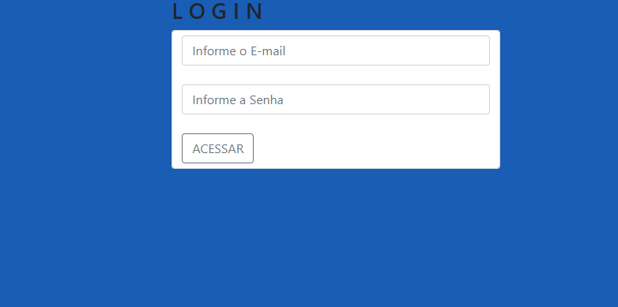
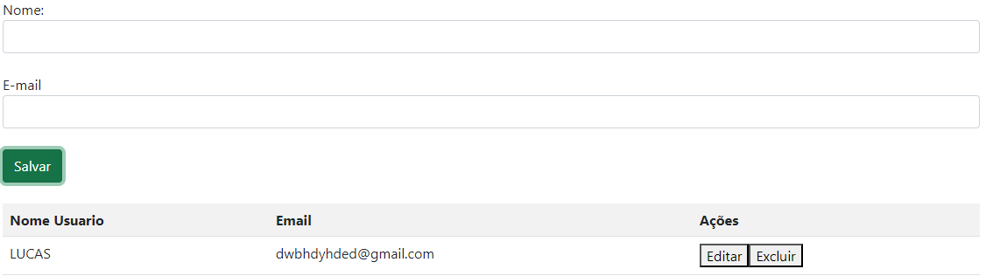

# Sistema de Cadastro e Login
Este projeto consiste em um sistema simples de cadastro e login. A telaa de login permite que o usuário insira seu e-mail e senha, verificando a autenticidade dos dados antes de acessar a tela de cadastro.

## Funcionalidades

1. **Tela de Login:**
  - Ao acessar o sistema, o usuário é direcionado para a tela de login.
  - O usuário deve inserir seu e-mail e senha para acessar a tela de cadastro.

2. **Tela de Cadastro:**
  - Após o login, o usuário é redirecionado para a tela de cadastro.
  - Nesta tela, o usuário deve inserir seu nome, e-mail e CPF.
  - O sistema verifica se todos os dados foram inseridos corretamente e se o e-mail e CPF são válidos.
  - Caso algum dado esteja incorreto ou incompleto, uma mensagem de alerta será exibida informando o erro.

4. **Salvar Cadastro:**
  - Após a inserção dos dados, o usuário deve clicar em "Salvar" para concluir o cadastro.
  - Os dados serão enviados e armazenados no sistema após a verificação.
  
## Imagens

## Alerta 

## Imagem da tela de login

## Cadastro salvando

## Instruções para Rodar o Projeto.
1. Clone o repositório em sua máquina local.
2. Abra o projeto utilizando um editor de código, como o Visual Studio Code.
3. Certifique-se de ter todas as dependências instaladas (se necessário).
4. Execute o projeto em seu ambiente local utilizando um servidor web.
